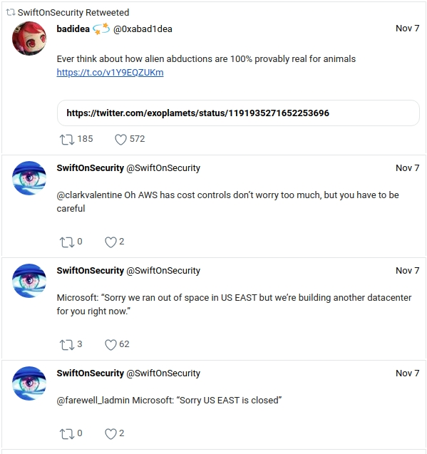

# tweetdigest
[](https://github.com/jakewarren/tweetdigest/releases)
[](https://github.com/jakewarren/tweetdigest/blob/master/LICENSE)
[](https://goreportcard.com/report/github.com/jakewarren/tweetdigest)
[](http://makeapullrequest.com)
> Compile tweets into a email digest

`tweetdigest` uses the Twitter API to compile tweets from users into a email digest. This digest is intended to be run for specific intervals such as daily.

## Install

This application requires API keys from Twitter (both the consumer API keys and access token). These can be acquired by creating an application from the Twitter developer portal at https://developer.twitter.com/.
Once you have your keys, create a copy of `config.sample.yml` and modify with your values.

### Option 1: Binary

Download the latest release from [https://github.com/jakewarren/tweetdigest/releases/latest](https://github.com/jakewarren/tweetdigest/releases/latest)

### Option 2: From source

```
go get github.com/jakewarren/tweetdigest
```

## Usage
```
❯ tweetdigest -h
Description: compiles tweets into an email digest

Usage: tweetdigest -d [duration] [twitter username]

Options:
  -c, --config string       filepath to the config file
  -d, --duration duration   how far back to include tweets in the digest (example: "-24h")
  -t, --email-to strings    email address(es) to send the report to
      --tweet-count int     number of tweets to analyze (max 200) (default 50)
  -V, --version             show version information
```

Example:

```
tweetdigest --duration "-24h" -c ~/.tweetdigest.yml SwiftOnSecurity
```

## Demo

Screenshot of the sample digest:



## Changes

All notable changes to this project will be documented in the [changelog].

The format is based on [Keep a Changelog](http://keepachangelog.com/) and this project adheres to [Semantic Versioning](http://semver.org/).

## License

MIT © 2019 Jake Warren

[changelog]: https://github.com/jakewarren/tweetdigest/blob/master/CHANGELOG.md
